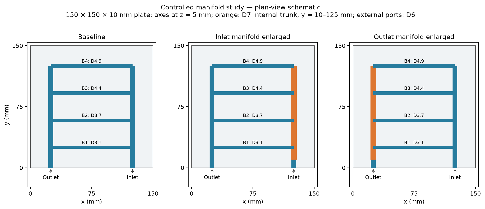
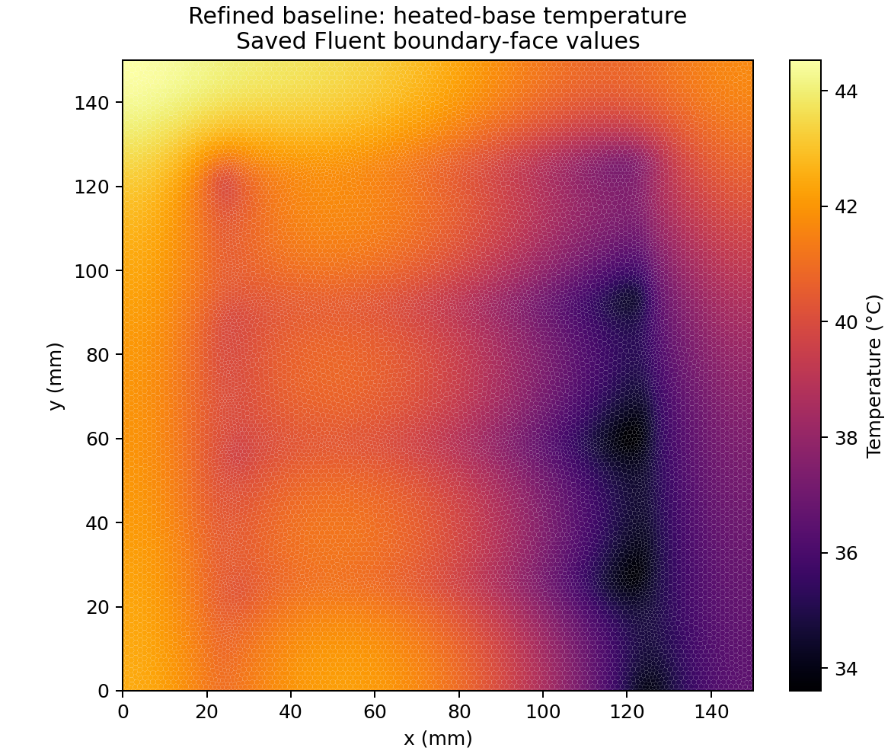

# Controlled manifold study

Converged comparison records are available; inspect the checks before publication.

## Geometry and comparison conditions

Baseline: original four-branch canopy reconstruction. Inlet7 and Outlet7 enlarge only the selected internal trunk to D7 from y=10 to 125 mm. External D6 ports, branches, footprint and thickness are retained. The internal transition is a sharp step. Coolant volume rises about 9.6%; minimum nominal cover decreases from 2 to 1.5 mm. No mechanical qualification is included.

Same steady laminar CHT physics: 200 W bottom heat, inlet 23 °C, ambient top 24 °C, anisotropic solid conductivity, CoolProp viscosity/conductivity tables and fixed density/cp. Equal-flow cases use 22.3 kg/h. Hydraulic power is volumetric flow multiplied by mass-weighted total-pressure loss, excluding pump efficiency and external loop losses. Static pressure difference is reported separately.

## Completed results

| Case | Flow (kg/h) | Base mean (°C) | Base max (°C) | Mean R (K/W) | Static Δp (Pa) | Total loss (Pa) | Hydraulic power (mW) |

|---|---:|---:|---:|---:|---:|---:|---:|

| baseline_refined | 22.3000 | 39.6696 | 44.5263 | 0.083348 | 91.0363 | 105.8563 | 0.65734 |
| baseline_screen | 22.3000 | 39.9317 | 44.7160 | 0.084658 | 96.1371 | 107.9371 | 0.67026 |
| inlet7_screen | 22.3000 | 40.0431 | 44.5469 | 0.085216 | 85.7964 | 97.7776 | 0.60717 |
| outlet7_refined_equal_power | 23.2010 | 39.0775 | 43.1116 | 0.080388 | 84.8401 | 101.6880 | 0.65697 |
| outlet7_refined | 22.3000 | 39.4474 | 43.5160 | 0.082237 | 79.5138 | 95.0040 | 0.58995 |
| outlet7_screen | 22.3000 | 39.5828 | 43.6411 | 0.082914 | 83.7584 | 96.6067 | 0.59990 |

At matched refined-baseline hydraulic power, the variant changes heated-base mean temperature by -0.5921 K and maximum by -1.4146 K. Achieved flow is 23.2010 kg/h; power mismatch is -0.056%. These are numerical differences, not experimentally validated design improvements. Interpret their magnitude against the grid changes and geometry uncertainty below.

Selection criterion: Lowest hydraulic power among the two enlarged-manifold variants at equal flow. This tests whether reduced resistance can offset any equal-flow thermal penalty at equal power; it is not a global optimization.

## Verification and uncertainty

Every new listed case must meet flow residuals ≤1e-6, energy ≤1e-9, mass imbalance <0.01%, and heat imbalance <0.01%. Equal-flow cases also require heated-base mean/max ranges ≤0.0001 K and total-pressure-loss range ≤0.01% across three saved checkpoints. Screening uses the Coupled pressure–velocity algorithm and its native multigrid controls. Confirmatory SIMPLEC runs tighten active equation AMG termination criteria to 0.001; each saved controls JSON records the actual settings. Intermediate residual plateaus are not accepted as converged results. The equal-power routine adjusts flow, then freezes the inlet and reconverges; allowable final power mismatch is 0.5%. Raw residual and balance records are retained in `03_ANSYS/Design_Study`.

Screening uses curvature 18°, minimum 0.16 mm, maximum 1.2 mm and five prism layers. Confirmatory meshing uses curvature 9°, minimum 0.09 mm, maximum 1.2 mm and eight layers, matching the existing refined baseline. Curved-wall faceting causes CAD-to-mesh volume discrepancy: the screening baseline fluid volume is about 5% below CAD. Report each mesh's volume and quality records. The older constant-property study showed opposing prism-layer and surface-refinement effects; overall mesh independence or a cold-plate GCI is not established.

The refined baseline's base temperatures are extracted offline from saved boundary-face SV_T and polygon areas. Their top mean/max cross-check native Fluent reports within 0.001 K. Native saved port reports supply its hydraulic reference: 0.65733685 mW. New cases use native Fluent heated-base and mass-weighted total-pressure reports. Section diagnostics retain area and interior-flow interpolation checks.

The independent pipe case verifies elementary laminar pressure loss and bulk energy to within 0.04% on its finest mesh. It does not experimentally validate this CHT geometry. Original CAD detail and heated-water functions from the paper remain unavailable, and the baseline differs from the paper. The 200 W footprint heat flux is 0.889 W/cm², not a demonstrated high-heat-flux electronics condition.

## Reproduction

See `03_ANSYS/Design_Study/README.md` for the clean phase runner. `build_summary.py` regenerates this table only from converged saved records. Publication follows completion and review of the additions.

