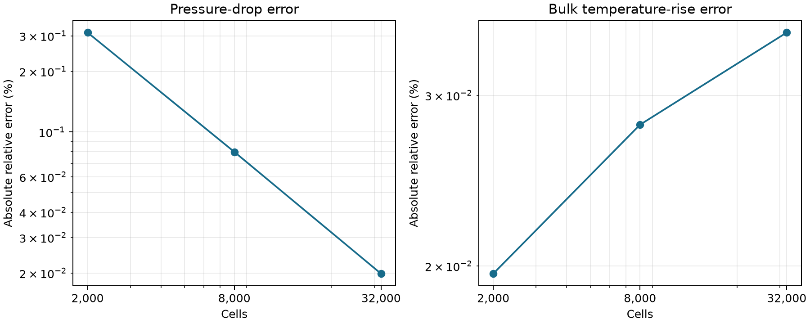

# Independent analytical pipe verification

## Purpose and scope

Verify elementary laminar-flow pressure loss and bulk energy balance independently of the canopy paper. This does not validate the cold plate experimentally or verify its anisotropic conjugate heat transfer.

## Reproducible setup

ANSYS Fluent 2024 R1, double precision, steady 2D axisymmetric, laminar, gravity off, energy enabled, second-order pressure/momentum/energy and pressure-based Coupled solution. Circular water pipe: radius 3 mm, length 100 mm, inlet 23 °C, nominal mean velocity 0.1 m/s, fully developed parabolic inlet, uniform wall heat flux 5,000 W/m², zero gauge-pressure outlet. Constant water properties at 23 °C match the project baseline. No viscous heating. Meshes are uniform axial/radial grids 100×20, 200×40 and 400×80.

Analytical pressure difference between x=20 and 80 mm: `Δp = 8 μ L_segment U_mean / R²`. Use the actual integrated flow-derived mean velocity for each mesh; inlet discretization produces nominal flow errors of 0.125%, 0.03125%, and 0.0078125%. Analytical wall heat is `Q = q_wall 2πRL = 9.424778 W`; bulk temperature rise is `Q / (mdot cp)`. This bulk estimate neglects axial conduction; Fluent retains conduction.

## Results

| Mesh | Cells | CFD interior Δp (Pa) | Pressure error (%) | CFD bulk rise (K) | Bulk-rise error (%) |
|---|---:|---:|---:|---:|---:|
| coarse | 2,000 | 4.962049 | -0.31146 | 0.797831 | -0.01963 |
| medium | 8,000 | 4.968926 | -0.07974 | 0.798512 | -0.02797 |
| fine | 32,000 | 4.970739 | -0.01985 | 0.798645 | -0.03482 |

The finest mesh gives Re=642.16. Pressure error decreases by approximately fourfold at each refinement. The observed order calculated from pressure resistance `Δp/U_mean` is 1.952. The thermal error is small but nonmonotonic; no thermal convergence order or thermal GCI is claimed. The residual thermal discrepancy has not been separated into axial-conduction, boundary-discretization and iterative contributions.

All cases meet flow residuals ≤1e-8, energy ≤1e-10, relative net mass flux <1e-6, and absolute net heat flux <1e-4 W. Finest heat imbalance is 0.000968% and mass imbalance is 3.075e-14%. These criteria and the agreement above support elementary numerical verification, not full physical validation.

## Files and sources

Scripts, meshes, converged case/data files, transcripts and raw JSON are in `03_ANSYS/Verification`. Run `pipe_mesh.py` and `solve_pipe.py` through the documented command driver; do not launch another solver over an active run. `build_report.py` rebuilds this report and figure from saved JSON.

- [ANSYS heated laminar pipe verification example](https://ansyshelp.ansys.com/public/Views/Secured/corp/v242/en/fbu_vm/Hlp_VMFL002.html): methodological precedent; our water case and metrics are independently specified.
- [NASA spatial convergence guidance](https://www.grc.nasa.gov/www/wind/valid/tutorial/spatconv.html): grid-refinement interpretation.
