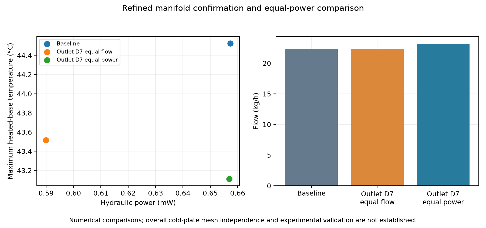
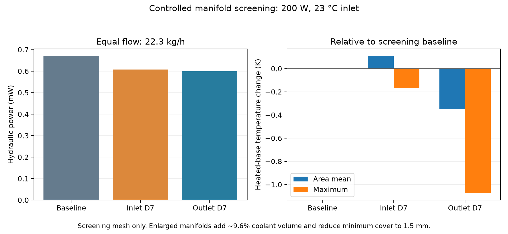

# Results overview

The refined equal-flow and equal-power comparisons are complete.

The matched screening comparison selects the enlarged outlet manifold: hydraulic power falls 10.497% and maximum heated-base temperature changes -1.0749 K. The inlet enlargement has a different mean-temperature tradeoff. These are screening findings, not proof of mesh-independent optimization.

| Case | Cells | Flow (kg/h) | Base mean (°C) | Base max (°C) | Static Δp (Pa) | Total loss (Pa) | Hydraulic power (mW) |
|---|---:|---:|---:|---:|---:|---:|---:|
| baseline_refined | 1390532 | 22.3000 | 39.6696 | 44.5263 | 91.0363 | 105.8563 | 0.65734 |
| baseline_screen | 335962 | 22.3000 | 39.9317 | 44.7160 | 96.1371 | 107.9371 | 0.67026 |
| inlet7_screen | 333006 | 22.3000 | 40.0431 | 44.5469 | 85.7964 | 97.7776 | 0.60717 |
| outlet7_refined_equal_power | 1364916 | 23.2010 | 39.0775 | 43.1116 | 84.8401 | 101.6880 | 0.65697 |
| outlet7_refined | 1364916 | 22.3000 | 39.4474 | 43.5160 | 79.5138 | 95.0040 | 0.58995 |
| outlet7_screen | 324300 | 22.3000 | 39.5828 | 43.6411 | 83.7584 | 96.6067 | 0.59990 |

At equal flow, the refined outlet variant changes hydraulic power by -10.252% and maximum heated-base temperature by -1.0103 K. At the refined baseline hydraulic power, achieved flow is 23.2010 kg/h; heated-base mean/max change by -0.5921 / -1.4146 K. These are numerical comparisons with volume/cover tradeoffs, rather than experimentally validated hardware improvements.

The outlet's equal-flow mean/max temperature benefit changes from -0.3489/-1.0749 K on screening meshes to -0.2222/-1.0103 K on refined meshes. Hydraulic-power reduction changes from 10.497% to 10.252%. The maximum-temperature and power benefits persist across these two resolutions; the smaller mean-temperature benefit is more sensitive. This comparison mixes mesh and algorithm changes, so it is sensitivity evidence, not a formal discretization-error estimate or confidence interval.

The finest independent pipe check gives 0.01985% pressure-drop error and 0.03482% bulk-temperature-rise error. Its pressure resistance has observed order 1.952. Thermal errors are nonmonotonic; a thermal GCI is not claimed.

See [design study](design_study.md), [pipe verification](pipe_verification.md), [mesh sensitivity](mesh_sensitivity.md), and [branch diagnostics](branch_diagnostics.md). Compact solver records and the physics audit accompany these findings.
